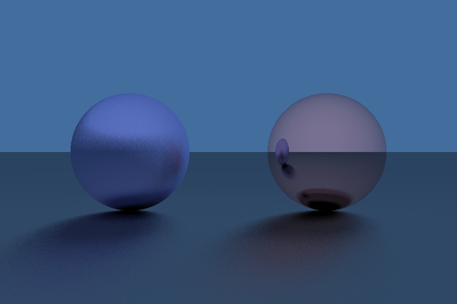
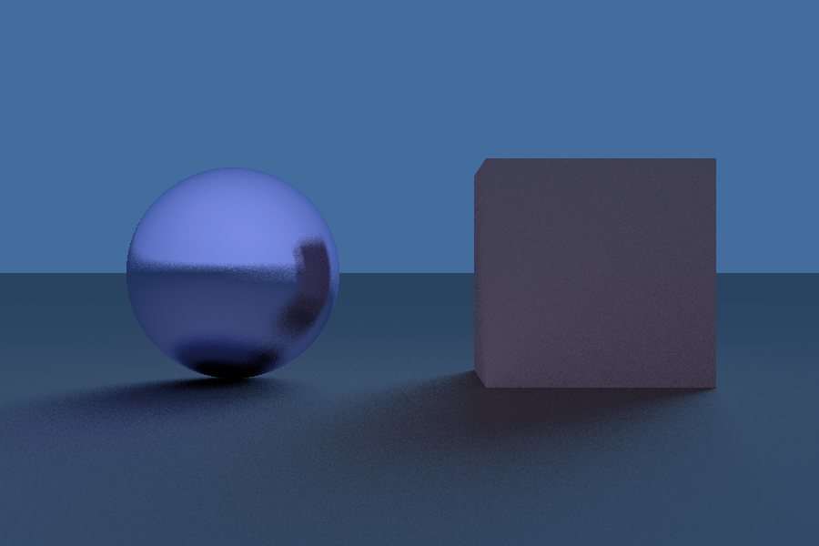

# Python Ray Tracing
[](https://opensource.org/licenses/MIT) <br/>
It's a simple ray tracing engine on python designed for rendering scenes. The code is written keeping as much readability as possible.

## Render example




## Installation and Launch
The project supports python 3.10.0 and higher. <br/>

Just clone or download this repo. <br/>

Install dependencies using the command `pip install -r requirements.txt`. 

Code example of a simple scene:

```python
import numpy as np
import matplotlib.pyplot as plt

from RTEngine import RayTracingEngine
from RTEngine import Material
from RTEngine.objects import Sphere, Cube

if __name__ == "__main__":
    scale = 3

    camera_pos = np.array([0, 0, 5])

    lights = [
        np.array([0.35, 0.9, -2])
    ]

    objects = [
        Sphere(np.array([0.5, 0, -1]), 0.3, Material([0.9, 0.6, 0.6], 0)),
        Sphere(np.array([-0.5, 0, -1]), 0.3, Material([0.6, 0.6, 0.9], 0.7)),
        Cube(np.array([0, -1000, -1]), 1000 - 0.3, Material([0.5, 0.5, 0.5], 0.3))
    ]

    rte = RayTracingEngine(300 * scale, 200 * scale, 6, camera_pos, objects, lights)

    plt.imsave('image.png', rte.render(sampling=8))
```
